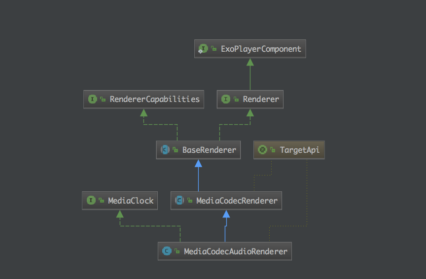
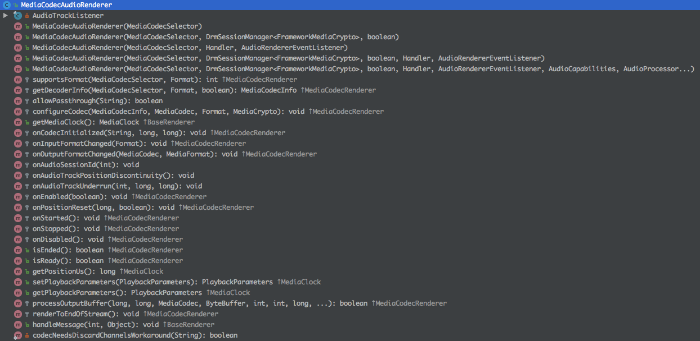
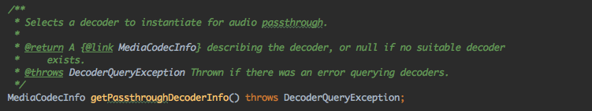

选择合适的音频passthrough解码器



#### 解码音频
```java
  @Override
  protected boolean processOutputBuffer(long positionUs, long elapsedRealtimeUs, MediaCodec codec,
      ByteBuffer buffer, int bufferIndex, int bufferFlags, long bufferPresentationTimeUs,
      boolean shouldSkip) throws ExoPlaybackException {
    if (passthroughEnabled && (bufferFlags & MediaCodec.BUFFER_FLAG_CODEC_CONFIG) != 0) {
      // Discard output buffers from the passthrough (raw) decoder containing codec specific data.
      codec.releaseOutputBuffer(bufferIndex, false);
      return true;
    }

    if (shouldSkip) {
      codec.releaseOutputBuffer(bufferIndex, false);
      decoderCounters.skippedOutputBufferCount++;
      audioTrack.handleDiscontinuity();
      return true;
    }

    try {
      if (audioTrack.handleBuffer(buffer, bufferPresentationTimeUs)) {
        codec.releaseOutputBuffer(bufferIndex, false);
        decoderCounters.renderedOutputBufferCount++;
        return true;
      }
    } catch (AudioTrack.InitializationException | AudioTrack.WriteException e) {
      throw ExoPlaybackException.createForRenderer(e, getIndex());
    }
    return false;
  }
```


