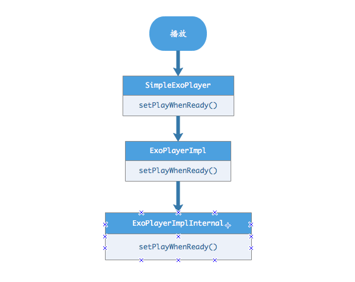
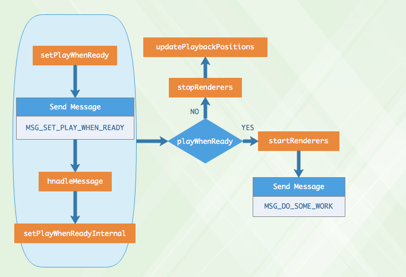

### EventListener 播放器时间回调

#### void onTimelineChanged(Timeline timeline, Object manifest)

#### void onTracksChanged(TrackGroupArray trackGroups, TrackSelectionArray trackSelections)

#### void onLoadingChanged(boolean isLoading)

#### void onPlayerStateChanged(boolean playWhenReady, int playbackState)

#### void onPlayerError(ExoPlaybackException error)

#### void onPositionDiscontinuity()

#### void onPlaybackParametersChanged(PlaybackParameters playbackParameters)

### ExoPlayerComponent 接受消息事件

#### void handleMessage(int messageType, Object message) throws ExoPlaybackException

### ExoPlayerMessage

**target**

**messageType**

**message**

[ExoPlayerImpl](/ExoPlayerImpl.md/)

## 解码,渲染
[MediaCodecVideoRenderer](/video/MediaCodecVideoRenderer.md)

[MediaCodecAudioRenderer](/audio/MediaCodecAudioRenderer.md)

## 整体播放流程

### 播放

[ExoPlayerImplInternal](ExoPlayerImplInternal.md)

