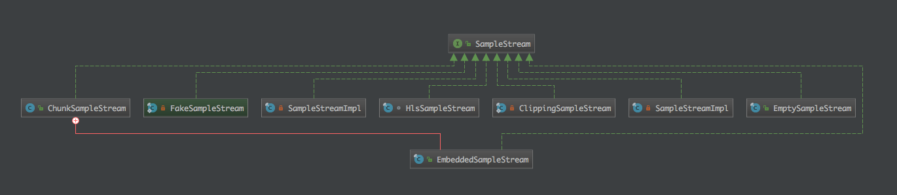
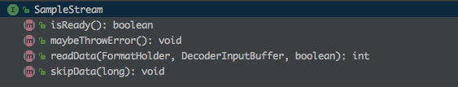

### 继承关系图

### 关键方法

#### boolean isReady()

#### void maybeThrowError() throws IOException

#### int readData(FormatHolder formatHolder, DecoderInputBuffer buffer, boolean formatRequired)

#### void skipData(long positionUs)

尝试跳到指定位置之前的关键帧，如果指定位置大于影片时间总长度，则跳到影片末尾