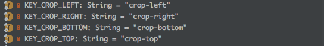
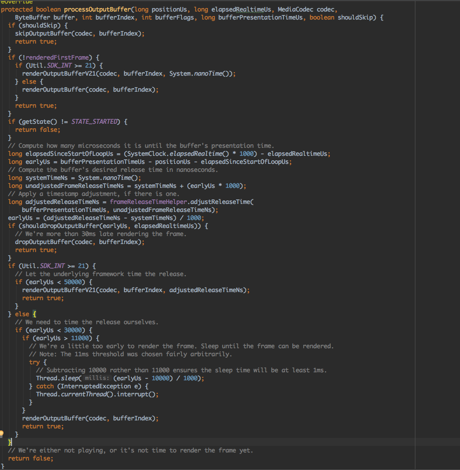

crop-left | 裁剪左侧
crop-right | 裁剪右侧
crop-bottom | 裁剪下侧
crop-top | 裁剪上侧

#### STANDARD_LONG_EDGE_VIDEO_PX

标准视频像素宽度

**1920, 1600, 1440, 1280, 960, 854, 640, 540, 480**


#### protected boolean processOutputBuffer(long positionUs, long elapsedRealtimeUs, MediaCodec codec, ByteBuffer buffer, int bufferIndex, int bufferFlags, long bufferPresentationTimeUs,boolean shouldSkip)



界面不渲染这段数据
```java
    if (shouldSkip) {
      skipOutputBuffer(codec, bufferIndex);
      return true;
    }
```

渲染第一帧视频
```java
    if (!renderedFirstFrame) {
      if (Util.SDK_INT >= 21) {
        renderOutputBufferV21(codec, bufferIndex, System.nanoTime());
      } else {
        renderOutputBuffer(codec, bufferIndex);
      }
      return true;
    }
```

##### TargetApi < 21

`public final void releaseOutputBuffer(int index, boolean render)`

If you are done with a buffer, use this call to return the buffer to the codec or to render it on the output surface. If you configured the codec with an output surface, setting render to true will first send the buffer to that output surface. The surface will release the buffer back to the codec once it is no longer used/displayed. Once an output buffer is released to the codec, it MUST NOT be used until it is later retrieved by getOutputBuffer(int) in response to a dequeueOutputBuffer(MediaCodec.BufferInfo, long) return value or a onOutputBufferAvailable(MediaCodec, int, MediaCodec.BufferInfo) callback.

**Parameters**

index	int: The index of a client-owned output buffer previously returned from a call to dequeueOutputBuffer(MediaCodec.BufferInfo, long).

render	boolean: If a valid surface was specified when configuring the codec, passing true renders this output buffer to the surface.

##### TargetApi >= 21

`public final void releaseOutputBuffer(int index, long renderTimestampNs)`

If you are done with a buffer, use this call to update its surface timestamp and return it to the codec to render it on the output surface. If you have not specified an output surface when configuring this video codec, this call will simply return the buffer to the codec.

The timestamp may have special meaning depending on the destination surface.

**SurfaceView specifics**

If you render your buffer on a SurfaceView, you can use the timestamp to render the buffer at a specific time (at the VSYNC at or after the buffer timestamp). For this to work, the timestamp needs to be reasonably close to the current nanoTime(). Currently, this is set as within one (1) second. A few notes:

>the buffer will not be returned to the codec until the timestamp has passed and the buffer is no longer used by the Surface.

>buffers are processed sequentially, so you may block subsequent buffers to be displayed on the Surface. This is important if you want to react to user action, e.g. stop the video or seek.

>if multiple buffers are sent to the Surface to be rendered at the same VSYNC, the last one will be shown, and the other ones will be dropped.

>if the timestamp is not "reasonably close" to the current system time, the Surface will ignore the timestamp, and display the buffer at the earliest feasible time. In this mode it will not drop frames.

>for best performance and quality, call this method when you are about two VSYNCs' time before the desired render time. For 60Hz displays, this is about 33 msec.

Once an output buffer is released to the codec, it MUST NOT be used until it is later retrieved by getOutputBuffer(int) in response to a dequeueOutputBuffer(MediaCodec.BufferInfo, long) return value or a onOutputBufferAvailable(MediaCodec, int, MediaCodec.BufferInfo) callback.

**Parameters**

index	int: The index of a client-owned output buffer previously returned from a call to dequeueOutputBuffer(MediaCodec.BufferInfo, long).

renderTimestampNs	long: The timestamp to associate with this buffer when it is sent to the Surface.

在渲染第一帧的时候，Api21之前和之后有些区别

计算从视频解码到图像呈现一共花了多长时间

`long elapsedSinceStartOfLoopUs = (SystemClock.elapsedRealtime() * 1000) - elapsedRealtimeUs;`

Compute how many microseconds it is until the buffer's presentation time.

用pts减去当前视频位置，再减去解码花的时间

`long earlyUs = bufferPresentationTimeUs - positionUs - elapsedSinceStartOfLoopUs;`

视频图像呈现的时间
```
    // Compute the buffer's desired release time in nanoseconds.
    long systemTimeNs = System.nanoTime();
    long unadjustedFrameReleaseTimeNs = systemTimeNs + (earlyUs * 1000);
```

对时间矫正
```
    // Apply a timestamp adjustment, if there is one.
    long adjustedReleaseTimeNs = frameReleaseTimeHelper.adjustReleaseTime(
        bufferPresentationTimeUs, unadjustedFrameReleaseTimeNs);
    earlyUs = (adjustedReleaseTimeNs - systemTimeNs) / 1000;
```

时间超过30ms丢弃
```
    if (shouldDropOutputBuffer(earlyUs, elapsedRealtimeUs)) {
      // We're more than 30ms late rendering the frame.
      dropOutputBuffer(codec, bufferIndex);
      return true;
    }
```

在指定条件下渲染视频
```java
    if (Util.SDK_INT >= 21) {
      // Let the underlying framework time the release.
      if (earlyUs < 50000) {
        renderOutputBufferV21(codec, bufferIndex, adjustedReleaseTimeNs);
        return true;
      }
    } else {
      // We need to time the release ourselves.
      if (earlyUs < 30000) {
        if (earlyUs > 11000) {
          // We're a little too early to render the frame. Sleep until the frame can be rendered.
          // Note: The 11ms threshold was chosen fairly arbitrarily.
          try {
            // Subtracting 10000 rather than 11000 ensures the sleep time will be at least 1ms.
            Thread.sleep((earlyUs - 10000) / 1000);
          } catch (InterruptedException e) {
            Thread.currentThread().interrupt();
          }
        }
        renderOutputBuffer(codec, bufferIndex);
        return true;
      }
    }
```


